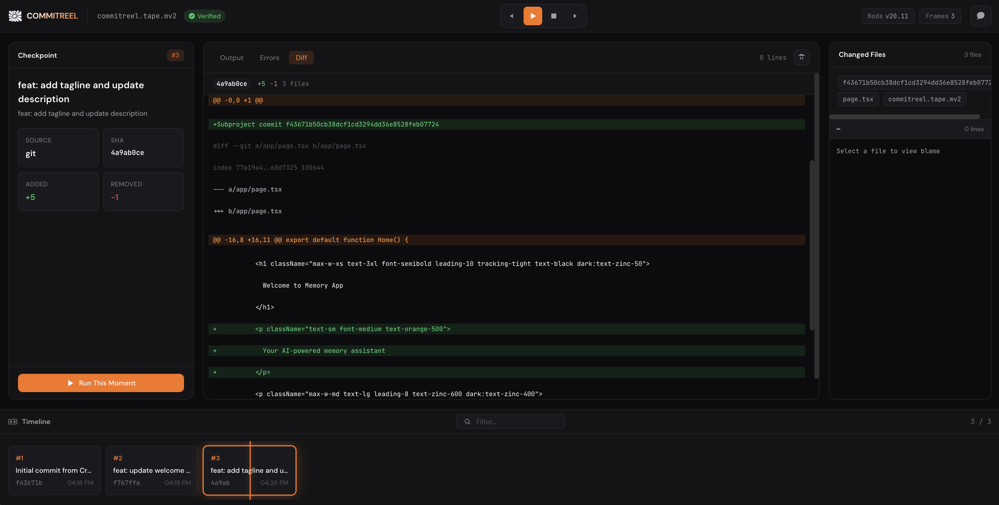

<div align="center">
  

# COMMITREEL

### **Time travel for checkpoints.**

*One file. Replay any moment. Zero config.*

[](https://www.npmjs.com/package/commitreel)
[](https://github.com/memvid/commitreel)
[](https://www.apache.org/licenses/LICENSE-2.0)

[Install](#install) • [Powered by MV2](#powered-by-mv2) • [Quick start](#quick-start) • [Commands](#commands) • [Notes](#notes-and-limits)

</div>

Time travel for checkpoints. Record a single MV2 tape, scrub a timeline, and run any moment on demand.

## Powered by MV2

CommitReel stores everything in a single `.mv2` file (Memvid's portable format for embeddings + metadata).
That means your entire timeline is **one file** you can move, archive, or share - no database required.

## What it does

- Records git checkpoints (or file snapshots if git is missing).
- Renders a video-editor style timeline in the web UI.
- Lets you **Run This Moment** to boot a checkpoint in an isolated worktree.
- Streams logs and highlights likely blame when a run fails.
- Stores everything in one portable tape file.

## Install

Global install:

```bash
npm install -g commitreel
```

Or run without installing:

```bash
npx commitreel start --web
```

## Quick start

```bash
commitreel start --web
```

This will:
- create `commitreel.tape.mv2`
- watch for git checkpoints
- launch the web UI at `http://0.0.0.0:23404` (falls back to `23405` if busy)

Record a different folder:

```bash
npx commitreel start --web --cwd /path/to/project
```

Open an existing tape:

```bash
npx commitreel web --out /path/to/commitreel.tape.mv2
```

## Works with Replit, Cursor, and local repos

CommitReel is not Replit-only. It works anywhere you have a git repo and a terminal:

- **Replit**: uses the git commits created by Agent checkpoints.
- **Cursor**: run the CLI in your local repo and it behaves the same.
- **Local projects**: any git repo works.

**Run This Moment** requires a detectable run command. CommitReel checks, in order:
1) `.replit` with `run = "..."`  
2) `package.json` scripts (`dev`, `start`, `preview`)  
3) fallback files (`index.js`, `server.js`, `main.py`, `app.py`)

If your stack is different, add a minimal `.replit` file with a `run` command.

You can also override the run command and mode:

```bash
npx commitreel start --web --run "python app.py" --run-mode web
```

## The web UI

The **Time-Travel Lab** is built to feel like a replay tool:

- Timeline reel with a playhead and checkpoint markers
- Checkpoint inspector with diff stats and metadata
- Live run logs
- Blame panel when a checkpoint fails
- Optional per-checkpoint AI chat

## How Run This Moment works

1. Creates a git worktree at the checkpoint commit
2. Detects the run command from `.replit` or `package.json`
3. Runs it on a fresh port in a temp directory
4. Streams logs to the UI
5. Cleans up on stop

Your main workspace is never modified.

## Commands

```bash
commitreel start [--out commitreel.tape.mv2] [--web] [--port 23404]
commitreel checkpoint "message" [--out commitreel.tape.mv2]
commitreel web [--out commitreel.tape.mv2] [--port 23404]
```

## Options

- `--out PATH` Tape file path (default: `commitreel.tape.mv2`)
- `--cwd PATH` Working directory (default: current directory)
- `--web` Start web UI
- `--port NUM` Web UI port (default: 23404, falls back to 23405 if busy)
- `--interval SECONDS` Git poll interval (default: 5)
- `--debounce MS` File checkpoint debounce (default: 4000)
- `--capture-files` Store changed file snapshots in MV2
- `--watch-files` Watch files even when git is available
- `--no-seed` Skip baseline checkpoint on start
- `--run CMD` Override run command used for checkpoints
- `--run-mode MODE` Run mode: auto, web, cli (default: auto)
- `--verbose` Verbose logs

## AI chat (optional)

Per-checkpoint AI chat is supported. Provide a key:

```bash
npx commitreel start --web --api-key YOUR_KEY --model openai
```

Environment variables:
- `COMMITREEL_API_KEY`
- `OPENAI_API_KEY` or `ANTHROPIC_API_KEY`
- `COMMITREEL_MODEL` (`openai` or `anthropic`)

## Notes and limits

- Best experience when git checkpoints exist.
- File snapshots work without git, but **Run This Moment** requires git.
- Non-web projects still run; the UI shows logs without a preview URL.
- If a project is misdetected, use `--run-mode cli` or `--run-mode web` to override.
- Database snapshots are not captured in v1.

## License

Apache-2.0
